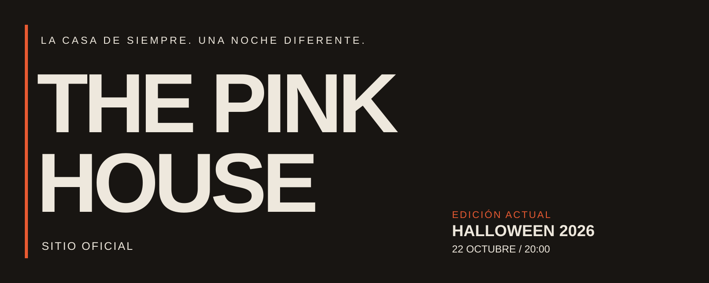

<p align="center"></p>

<p align="center">
  <a href="https://dmataguerra.github.io/pink-house-page/">Visitar The Pink House</a> ·
  <a href="https://www.instagram.com/david_mata_g/">Pedir ubicación</a> ·
  <a href="https://calendar.app.google/HCNWJHqhFCBNuWdn9">Confirmar asistencia</a>
</p>

<p align="center"><a href="https://github.com/dmataguerra/pink-house-page/actions/workflows/deploy.yml"></a></p>

## La casa de siempre. Una noche diferente.

**The Pink House** es nuestra casa en internet: un lugar para conocer las próximas noches, descubrir lo que estamos preparando y confirmar tu asistencia. La identidad permanece; la temática cambia con cada edición.

Actualmente estamos en **modo Halloween**. Una noche de disfraces, música, juegos y pedas caseras con el estilo de The Pink House.

## Halloween 2026

| | Tu noche en la casa |
| :--- | :--- |
| Fecha | Jueves 22 de octubre de 2026 |
| Hora | Desde las 20:00, hora del centro de México |
| Disfraz | Recomendado, no obligatorio. Habrá concurso y premio al mejor. |
| Ubicación | Se comparte al confirmar. Puedes pedirla por Instagram. |
| Bebidas | Trae lo que te gusta tomar. También habrá bebidas de nuestra parte. |

**Lo que pasa en la Pink House se queda en la Pink House.**

## Explora la página

- **La casa:** nuestra historia y el espíritu de esta edición.
- **La noche:** fecha, disfraces, concurso y cómo conseguir la ubicación.
- **Pink House Archive:** imágenes y mensajes que forman parte de nuestra identidad.
- **Tu entrada:** confirma tu asistencia y abre el ticket de la momia para descubrir el plan de la noche.
- **Locación:** un recorrido en video, con reproducción ampliada.

La página incluye cuenta regresiva, navegación móvil, imágenes optimizadas y una alternativa de movimiento reducido. El ticket funciona con mouse, pantalla táctil y teclado.

## Una identidad que cambia de temporada

Halloween combina luz roja y ámbar, fotografía cinematográfica, tipografía editorial y espacios claros que dan respiro al recorrido. Las siguientes ediciones podrán cambiar su atmósfera conservando el nombre, el archivo y la forma de encontrarnos.

## Desarrollo local

Construido con React, TypeScript, Vite y GSAP. Usa Node.js 22, la misma versión del workflow de publicación.

```sh
npm ci
npm run dev
```

Abre la dirección indicada por Vite con la ruta `/pink-house-page/`.

```sh
npm run typecheck
npm run build
```

### Actualizar una edición

| Contenido | Archivo |
| :--- | :--- |
| Fecha, hora, Instagram y asistencia | [`src/config/event.ts`](src/config/event.ts) |
| Entradas del archivo | [`src/data/parties.ts`](src/data/parties.ts) |
| Hero y composición principal | [`src/components/HeroLanding.tsx`](src/components/HeroLanding.tsx) |
| Secciones y textos editoriales | [`src/sections/Editorial.tsx`](src/sections/Editorial.tsx) |
| Fotos, ilustraciones y video | [`public/`](public/) |

Al cambiar de temática, revisa también los textos, las imágenes y los metadatos de `index.html`.

### Publicación

El [workflow de GitHub Pages](.github/workflows/deploy.yml) instala las dependencias, genera `dist/` y publica el sitio. Se ejecuta con cambios en `main` o mediante ejecución manual. Un PR abierto por sí solo no publica la nueva versión.

## Documentación

- [Guía para colaborar](CONTRIBUTING.md)
- [Notas de implementación y continuidad](docs/CONTINUITY.md)
- [Identidad y uso de assets](docs/BRAND.md)

El código y los assets no tienen una licencia de reutilización abierta declarada. Consulta las notas de identidad antes de reutilizar material visual o tipográfico.

---

<p align="center">Hecho para las noches de The Pink House · © 2026 dmataguerra</p>
